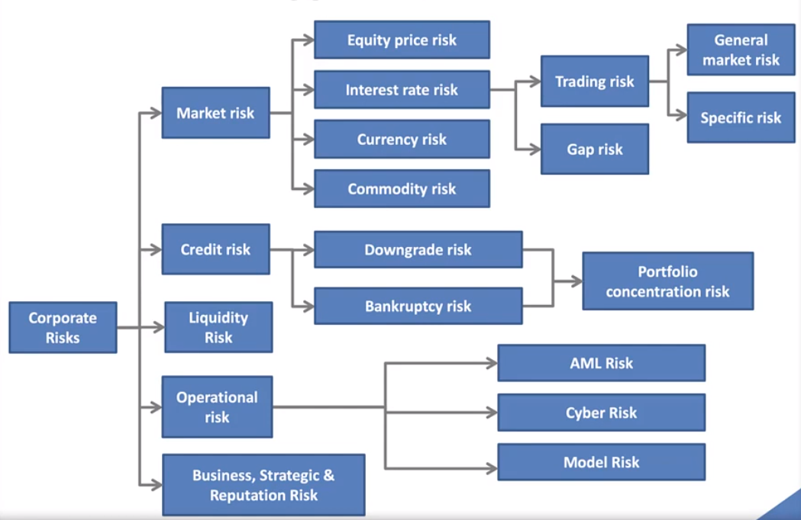
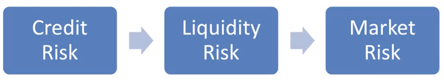
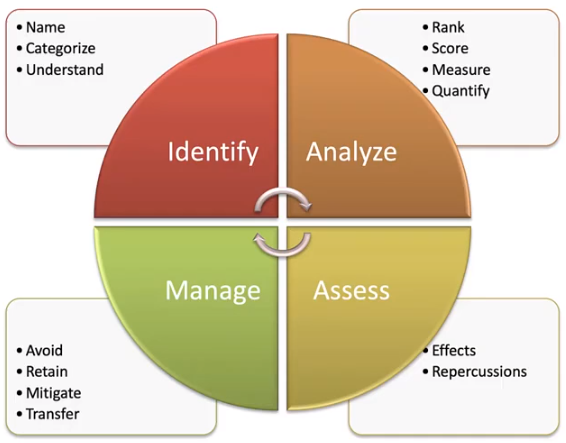
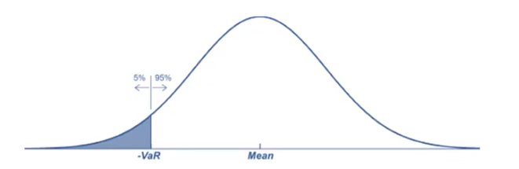

# The Building Blocks of Risk Management

## What is Risk

* Potential **variability of returns** around an expected return
  * Financial risk can be **managed and mitigated\***
  * There is **no return without risk**
* **Risk managers** pride themselves in their ability to **price risks** and provide adequate\* **compensation\* for the risk** taken in business activities
  * Example: To generate a return for shareholders, lenders such as JPMorgan Chase are faced with constant credit risk - borrowers/mortgagors may default on agreed-upon payments.

_**RISK**_ : The variability that can be quantified in terms of probabilities.

_**UNCERTAINTY**_ : The variability that cannot be quantified at all. 

### Words


* _mitigate_
  * lessen or to try to lessen the seriousness or extent of
  * make less severe or harsh
* _adequate_: 
  * \(sometimes followed by \`to'\) meeting the requirements especially of a task

    _"she had adequate training"; " her training was adequate"; " she was adequate to the job"_

  * enough to meet a purpose

    _"an adequate income"; " the food was adequate"_

  * about average; acceptable

    _"more than adequate as a secretary"_
* _compensation_
  * something \(such as money\) given or received as payment or reparation \(as for a service or loss or injury\)
  * \(psychiatry\) a defense mechanism that conceals your undesirable shortcomings by exaggerating desirable behaviors
  * the act of compensating for service or loss or injury


## Types of Risk

* Risk can be grouped depending on different types business environments
  * Grouping of the risks is essential for the business institutions to factor into specific risks while managing them 
* Each type of risk needs different skills to manage it. 

## Market Risks

### Classification

There are 4 risks associated with market risk

* **Equity price risk**
  * Volatility\* in the stock prices
* **Interest rate risk**
  * Fluctuations in the market interest rates which may cause a decline in the value of interest rate sensitive portfolios
    * Example: bond and interest are anticorrelate. 
* **Currency risk**
  * Manifests\* in operations that involve foreign currencies
  * Imperfectly hedged positions in certain currencies may arise, causing exposure to exchange rates.
* **Commodity\* risk**
  * The volatility associated with the prices of commodities

Market risk the potential reduction\* in value of a portfolio\* or security due to changes in financial market prices and rates. 

* Price risk
  * General market risk component
    * Variability in returns due to changes in economic information
  * Specific Market risk component
    * Variability in returns to the firm specific information 

### Issue

**Systematic risk is not affected by diversification.**

**Idiosyncratic\* or specific risk** is the component of volatility determined by firm specific characteristics like its management or product lines. Academics call this **Unsystematic Risk**, which can be virtually eliminated through **diversification**. 

### Words


* _equity_
  * the difference between the market value of a property and the claims held against it
  * the ownership interest of shareholders in a corporation
  * conformity with rules or standards
* _manifest_
  * provide evidence for; stand as proof of; show by one's behavior, attitude, or external attributes

    _"The buildings in Rome manifest a high level of architectural sophistication"_

  * record in a ship's manifest

    _"each passenger must be manifested"_

  * reveal its presence or make an appearance

    _"the ghost manifests each year on the same day"_
* _commodity_
  * a product or a raw material that can be bought and sold
* _reduction_
  * the act of decreasing or reducing something
  * any process in which electrons are added to an atom or ion \(as by removing oxygen or adding hydrogen\); always occurs accompanied by oxidation of the reducing agent
* _portfolio_
  * a large, flat, thin case for carrying loose papers or drawings or maps; usually leather

    _"he remembered her because she was carrying a large portfolio"_

  * a set of pieces of creative work collected to be shown to potential customers or employers

    _"the artist had put together a portfolio of his work"; " every actor has a portfolio of photographs"_

  * **a list of the financial assets** held by an individual or a bank or other financial institution

    _"they were disappointed by the poor returns on their stock portfolio"_

  * the role of the head of a government department

    _"he holds the portfolio for foreign affairs"_
* _idiosyncratic_
  *  peculiar to the individual

    _"we all have our own idiosyncratic gestures"; " Michelangelo's highly idiosyncratic style of painting"_
* _volatility_
  * the property of changing readily from a solid or liquid to a vapor
  * the trait of being **unpredictably** irresolute

    _"the volatility of the market drove many investors away"_

  * being easily excited


## Credit Risk

### Classification

There are two types of risks

* Downgrade risk
  * The risk that there might be a decline in credit ratings of a borrower because of a drop in his creditworthiness
* Bankruptcy risk
  *  The risk associated with a borrower's inability to clear his debt leading to a takeover of his collateralized assets.

### Issues

* Creditworthiness of the obligor\* 
  * Based on this, appropriate interest rate or spread should be charged to compensate for the risk undertaken
* Concentration\* risk
  * The extent of diversification of the obligor should be a concern
* State of the economy
  * When the economy is booming, the frequency of defaults is comparatively lower than when there is a recession\* 

### Words


* _obligor_
  * a person who binds himself by contract to perform some obligation; debtor
* _concentration_
  * \(chemistry\) the strength of a solution; number of molecules of a substance in a given volume \(expressed as moles/cubic meter\)
  * the spatial property of being crowded together
  * strengthening the amount of a substance in a unit amount of another substance \(as of a solute in a mixture\) by removing the other substance
  * increase in density
  * complete attention; intense mental effort
  * bringing together military forces
  * great and constant diligence and attention
* _recession_
  * the state of the economy declines; a widespread decline in the GDP and employment and trade lasting from six months to a year
  * a small concavity
  * the withdrawal of the clergy and choir from the chancel to the vestry at the end of a church service
  * the act of ceding back
  * the act of becoming more distant


## Liquidity Risk

Liquidity risk is the risk that a firm may be unable to **meet short-term financial needs**.

### Classification

* Funding liquidity risk
  * The risk that a firm will not be able to settle its obligations immediately when they are due
* Trading liquidity risk \(Market liquidity risk\)
  * The risk associated with the inability of a firm to execute transactions at the prevailing\* market price

### Words


* prevail
  * be larger in number, quantity, power, status or importance
  * be valid, applicable, or true
  * continue to exist
  * prove superior

    _"The champion prevailed, though it was a hard fight"_

  * use persuasion successfully

    _"He prevailed upon her to visit his parents"_


## Operational Risk

Operational risk is the risk that arises due to operational weaknesses like management failure, faulty controls, inadequate\* systems, etc. 

### Classification

* Anti-Money Laundering \(AML\) risk
  * Anti-money laundering refers to a set of laws, regulations, and procedures intended to prevent criminals from disguising illegally obtained funds as legitimate income. 
* Cyber risk
  * The risk of a cyber attack or data breach\* on an organization
* Model risk
  * The financial model is used to measure quantitative information fails or performs inadequately. 

### Words


* inadequate
  * \(sometimes followed by \`to'\) not meeting the requirements especially of a task

    _"inadequate training"; " the staff was inadequate"; " she was inadequate to the job"_

  * not sufficient to meet a need

    _"an inadequate income"_
* breach
  * n
    * a failure to perform some promised act or obligation
    * an opening \(especially a gap in a dike or fortification\)
    * a personal or social separation \(as between opposing factions\)
  * v
    * act in disregard of laws, rules, contracts, or promises
    * make an opening or gap in


## Business, Strategic & Reputation Risk

### Classification

* **Business risk**
  * It arises from **uncertainties** in demands, the cost of production and the cost of delivery of products.
* **Strategic risk**
  * Risk associated with the **risk of significant investments** for which the uncertainty of success and profitability is high
* **Reputation risk**
  * The firm can settle its obligations to counterparties and creditors
  * The firm follows **ethical practice**

## Interaction of Risk Types

Risks can flow from one type to another

* For instance, during hard business time, the risk can flow from credit risk to liquidity risk and then to market risk
* The kind of flow was seen in 2007-2009 financial crisis.
* These things react would be very fast.

## Risk Management Process

## Methods of Risk Management

### Classification

* **Avoiding the risk**
  * For instance, closing down the business unit or changing the business strategy
* **Retaining\* or keeping the risk**
  * Accepting the riskiness of a project
* **Mitigation of the risk**
  * Decrease the exposure, frequency and the severity\* of the risk
* **Transfer risk**
  * This method applied to risks that can be transferred to a third party
  * An example is in derivative products where a company pays a premium\* to a party to accept a certain level of risk. 

### Unknown & Known Risks

* Unknowns Unknowns
* Knowns Unknowns
* Unexpected Loss **\(UL\)**
* Expected Loss **\(EL\)**

### Words


* _retain_
  * hold within

    _"This soil retains water"; " I retain this drug for a long time"_

  * allow to remain in a place or position

    _"She retains a lawyer"_

  * secure and keep for possible future use or application

    _"The landlord retained the security deposit"_

  * keep in one's mind

    _"I cannot retain so much information"_
* _severity_
  * used of the degree of something undesirable e.g. pain or weather
  * something hard to endure
  * extreme plainness
  * excessive sternness

    _"severity of character"_
* _premium_
  * payment for insurance
  * the amount that something in scarce supply is valued above its nominal value

    _"they paid a premium for access to water"_

  * a fee charged for exchanging currencies
  * payment or reward \(especially from a government\) for acts such as catching criminals or killing predatory animals or enlisting in the military


## Expected Loss \(EL\)

### Definition

* The **mean loss an investor might expect** to experience from a portfolio

### Calculation

$$
EL = EAD \times LGD \times PD
$$

* **Probability of Default \(PD\)** : the probability of occurrence of risk event
* **Loss Given Default \(LGD\)** : The size \(severity\) of the loss
* **Exposure at Default \(EAD\)** : The exposure to risk

The risk managers must **subdivide the risk** into discrete risk factors \(EAD, LGD, PD\) so that **each factor and the interactions** between these factors can be **studied**.

### Words


* _default_
  * loss due to not showing up

    _"he lost the game by default"_

  * act of failing to meet a financial obligation
  * loss resulting from failure of a debt to be paid
  * an option that is selected automatically unless an alternative is specified


### Unexpected Loss

The average total loss over and above the expected loss

* It's the **variation in the expected loss**
* It's calculated as the **standard deviation** from the mean at a certain confidence level \(More of these in subsequent chapters\)

## Value-at-Risk \(VaR\)

### Definition

* VaR is a statistical measure that defines a particular level of loss in terms of its chances of occurrence
  * i.e. The confidence level of the analysis
* Example
  * It can be said that our options position has a one-day VaR of $1 Million at the 95% confidence level. 
  * There is only a 5% probability of a loss that is greater than $1 million on any given trading day. 

### Issue

* Tail risks are those that rarely occur. 
  * They can be explained as the extreme version of unexpected loss that is hard to find in the given data. 

## Human Agency and Conflicts of Interest

### Introduction

* Many financial firms have employed three ways to control human agency and conflicts of interest
  * Firms create business models that can identify and manage risk
  * Employing risk managers that are qualified in risk management and day-to-day oversight\*
  * Periodic independent oversight and assurance\*
* Sometimes traders and industry leadership willingly after the credibility of the risk management systems
  * That why grasping\* the role of human agency, self-interest, and conflicts interest are one of the cornerstones of risk management

### Words


* _oversight_
  * an unintentional omission resulting from failure to notice something
  * management by overseeing the performance or operation of a person or group
  * a mistake resulting from inattention
* _assurance_
  * freedom from doubt; belief in yourself and your abilities

    _"his assurance in his superiority did not make him popular"_

  * a binding commitment to do or give or refrain from something

    _"an assurance of help when needed"_

  * a statement intended to inspire confidence

    _"the President's assurances were not respected"_

  * a British term for some kinds of insurance
* _grasp_
  * n.
    * understanding of the nature or meaning or quality or magnitude of something

      _"he has a good grasp of accounting practices"_

    * the limit of capability
    * a firm controlling influence

      _"a terrible power had her in its grasp"_

    * the act of grasping
  * v.
    * hold firmly
    * get the meaning of something


## Risk Aggregation

The risk manager should be able to **identify riskiest businesses** and determine the **aggregate risks of a firm.** 

* **Market risks** are easily quantified and controlled by comparing the **notional\* amount in each asset held**
  * This impractical since different stocks and industries have **different volatilities**
* Derivative traders developed risk measures termed as **the Greeks**
  * Greeks are still used up to date, but they **cannot be added up**, rendering\* them limited in the enterprise level
* Another measure of risk is **VaR**
  * VaR does **not give the magnitude of the loss**

Understanding how risks are aggregated and the **drawbacks and advantages** that come with it is an essential **risk management building block**

### Words


* _notional_
  * not based on fact; dubious

    _"to create a notional world for oneself"_

  * not based on fact or investigation

    _"a notional figure of cost helps in determining production costs"_

  * indulging in or influenced by fancy

    _"all the notional vagaries of childhood"_

  * being of the nature of a notion or concept

    _"to improve notional comprehension"; " a notional response to the question"_
* render
  * n. a substance similar to stucco but exclusively applied to masonry walls
  * v.
    * cause to become

      _"The shot rendered her immobile"_

    * provide or furnish with
    * give an interpretation or rendition of

      _"The pianist rendered the Beethoven sonata beautifully"_

    * give or supply

      _"The estate renders some revenue for the family"_

    * pass down

      _"render a verdict"_

    * make over as a return

      _"They had to render the estate"_

    * give back

      _"render money"_

    * to surrender someone or something to another

      _"render up the prisoners"; " render the town to the enemy"_

    * show in, or as in, a picture

      _"the face of the child is rendered with much tenderness in this painting"_

    * coat with plastic or cement

      _"render the brick walls in the den"_

    * bestow

      _"render thanks"_

    * restate \(words\) from one language into another language

      _"She rendered the French poem into English"_

    * melt \(fat or lard\) in order to separate out impurities

      _"render fat in a casserole"_


## Risk and Reward Equilibrium

* Higher systematic risk usually associated with higher return from a portfolio

$$
RAROC = \dfrac{Reward}{Risk}
$$

Or

$$
RAROC = \dfrac{After\enspace Tax\enspace Risk\enspace Adjusted\enspace Expected\enspace Return}{Economic\enspace Capital}
$$

* If the RAROC is **higher than the cost of equity capital**, then the portfolio is valuable to the investor

## Enterprise Risk Management \(ERM\)

* ERM is the process of planning, organizing leading and controlling the activities of an organization in order to minimize the effects of risk on an organization's capital and earnings as a whole
* ERM overcomes the challenge to "siloed" risk management, where each unit of an institution manages its own risk independently
  * Risk is multi-dimentional: 
    * It should be approached from all angles and using diverse methods
  * Risk demands specialized judgement
    * That is seconded by statistical science application
  * Risk develops across all risk types 
    * Thus one may miss the point by analyzing one risk at a time

