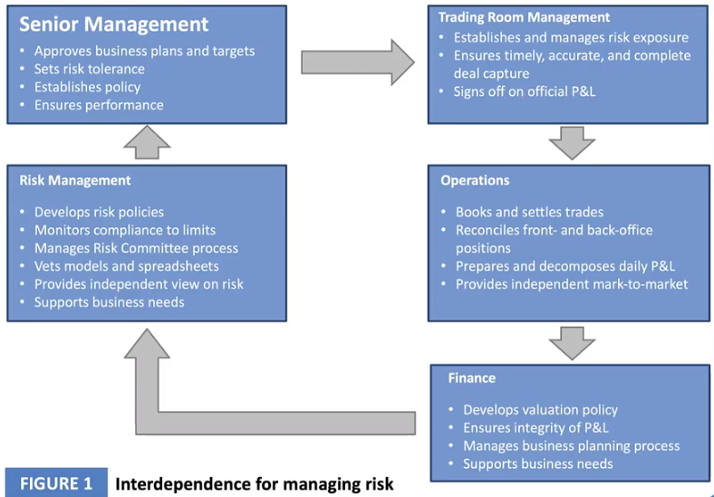
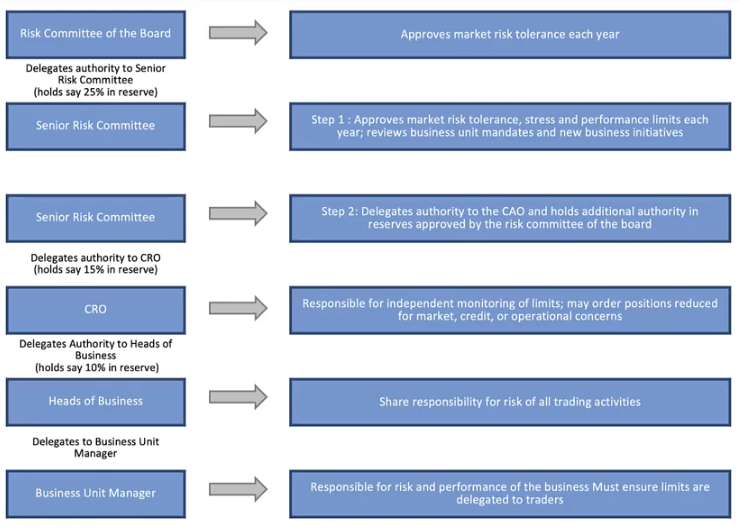

# The Governance of Risk Management

## Link Between Corporate Governance and Risk Management

* Corporate governance refers to the system of rules, practices, and controls put in place by a firm to ensure accountability, transparency, and achievement of long-term goals. 
* Risk management it a critical part of corporate governance.
  * It's important for firms to come up with clear rules, regulations, and procedures that govern all risk management activities
  * Failure of the risk management function is almost always blamed on improper governance
* Recent corporate failures including the 2007/2009 financial crisis have largely been attributed to a lack of transparency and breakdown in the transmission of relevant information to decision makers. 

## Corporate Governance and Risk Management are Inseparable

* From a corporate governance perspective, the board has a primary objective to prioritize and look after the interests of shareholders
  * With that comes the need to identify the risks the business needs to assume so as to generate a return for the shareholders
* The board also has to look after the interests of debt holders
  * While appraising\* any capital project, the board needs to assess the project's riskiness and the probability of insolvency\*, which could be detrimental\* to debt holders
* Recent events have served to align\* the goals of corporate governance with those of risk management, giving rise to "risk governance"
  * For instance, firms worldwide have adopted a governance structure where the CEO and board chairman are two separate offices. The aim is to further strengthen the independence of the board such that members can evaluate the risk profiles of projects presented to them without bias or compromise\*.

### Words


* _appraise_
  * place a value on; judge the worth of something

    _"I will have the family jewels appraised by a professional"_

  * consider in a comprehensive way

    _"He appraised the situation carefully before acting"_
* _insolvency_
  * the lack of financial resources
* _detrimental_
  * \(sometimes followed by \`to'\) causing harm or injury
* _compromise_
  * n.
    * a middle way between two extremes
    * an accommodation in which both sides make concessions

      _"the newly elected congressmen rejected a compromise because they considered it \`business as usual'"_
  * v.
    * make a compromise; arrive at a compromise

      _"nobody will get everything he wants"; " we all must compromise"_

    * settle by concession
    * expose or make liable to danger, suspicion, or disrepute

      _"The nuclear secrets of the state were compromised by the spy"_


## Risk Governance

### The Responsibility of the Board of Directors

* Steer\* the firm according to the interests of the shareholders
* Look after the interests of other stakeholders such as debt holders while developing strategies at the corporate level
* Ensure the sustainability of projects/profits
* Keep an eye on agency risks i.e. conflict of interests between the management and stakeholders

Governance roles should be independent of executive roles, i.e. the board and the CEO should act independently of each other

There's a global push to have firms appoint chief risk officers \(CROs\) who attend board meetings and report directly to the board. 

### Board Members Must Understand Business Strategies and Associated Risk

* The risks associated with business activities should be made transparent to the stakeholders
* An appropriate risk appetite should be set for the firm and board should oversee the managerial activities and strategy formulation process
  * Risk management has to be part of business planning
  * Risks associated with every target should be properly assessed to see if they fit into the firm's risk appetite

### The Risk Management Compass\*

For every risk, a firm has four basic choices

* Accept 
  * Firm take all the risk
* Mitigate
  * Preventive\*/detective measures
  * Firm take part of the risk
* Transfer
  * Insurance/outsourcing
  * Firm eliminate the risk and transfer to others
* Reject

### Key Points

Risk management strategies should be directed to impact economic performance rather than accounting performance.

* Policies, directives, and infrastructure related to risk management should be properly placed in a firm
* Align risk and reward
  * The board should make sure that staff get rewarded according to their risk-adjusted performance
  * This checks fraud related to financial manipulation and stock price boosting
* The board should check the quality and reliability of information about risks
* The board should be educated on risk management and should be able to determine the appropriate risk appetite for the firm
  * There should also be an assessment of risk metrics over a specified time horizon that the board may set.
* Some technical sophistication\* is required to build clear strategies and directives in relation to key risk disciplines\*
  * A risk committee of the board should be qualified enough to handle these technicalities 
  * The risk committee should be separate from the audit committee on grounds of difference in skills and responsibilities.

### Words


* steer
  * n.
    * an indication of potential opportunity
    * castrated bull
  * v.
    * direct the course; determine the direction of travelling
    * direct \(oneself\) somewhere
    * be a guiding force, as with directions or advice

      _"The teacher steered the gifted students towards the more challenging courses"_
* compass
  *  * n.
      * navigational instrument for finding directions
      * an area in which something acts or operates or has power or control:

        _"within the compass of this article"_

      * the limit of capability

        _"within the compass of education"_

      * drafting instrument used for drawing circles
    * v.
      * bring about; accomplish

        _"This writer attempts more than his talents can compass"_

      * travel around, either by plane or ship

        _"We compassed the earth"_

      * get the meaning of something
* preventive
  * n.
    * remedy that prevents or slows the course of an illness or disease
    * any obstruction that impedes or is burdensome
    * an agent or device intended to prevent conception
  * adj.
    * preventing or contributing to the prevention of disease

      _"preventive medicine"_

    * tending to prevent or hinder
* sophistication
  * uplifting enlightenment
  * a deliberately invalid argument displaying ingenuity in reasoning in the hope of deceiving someone
  * being expert or having knowledge of some technical subject

    _"understanding affine transformations requires considerable mathematical sophistication"_

  * the quality or character of being intellectually sophisticated and worldly through cultivation or experience or disillusionment
  * falsification by the use of sophistry; misleading by means of specious fallacies

    _"he practiced the art of sophistication upon reason"_
* discipline
  * n.
    * a branch of knowledge

      _"in what discipline is his doctorate?"_

    * a system of rules of conduct or method of practice

      _"he quickly learned the discipline of prison routine"; " for such a plan to work requires discipline"_

    * the trait of being well behaved

      _"he insisted on discipline among the troops"_

    * training to improve strength or self-control
    * the act of punishing

      _"the offenders deserved the harsh discipline they received"_
  * v.
    * train by instruction and practice; especially to teach self-control

      _"Parents must discipline their children"_

    * punish in order to gain control or enforce obedience

      _"The teacher disciplined the pupils rather frequently"_


## Role of Audit Committee of the Board

* The audit committee's responsibility is to look into the accuracy of financial and regulatory reporting of the firm and the quality of processes that underlie such activities
  * The members should ideally be nonexecutives so as to keep the audit committee clear from executive influence. 
  * The audit committee should interact with the management productively and should keep all channels of communication open
* The audit committee verifies the activities of the firm to see if the reports outline the same.
* It ensures that a bank complies with standards in regulatory, risk management, legal and compliance activities. 

## The Role of Risk Advisory Director

* Presence of nonexecutives without any risk management expertise in the board may create an environment where decisions are made in a manner not so well thought-out.
* For this reason, there should be a risk management specialist - a risk advisory director - on the board
* The risk advisory director should 
  * Oversee development of risk management policies and reports 
  * Oversee financial reporting and the dealings between the firm and its associates
  * Ensure compliance with regulatory requirements
  * Participate in risk committee meetings to provide independent review of risk reports

## Role of Risk Management Committee of the Board

* Independently review different forms of risks like liquidity risk, market risk, etc. and the policies related to them
* Approve individual credits
* Monitor portfolios and major trends in the market as well as breakdowns in the industry liquidity crunch, etc. 
* Report to the board about matters related to risk levels, credits and also provide opportunities for direct interaction with the external auditor, management committees, etc. 

### Words


* crunch
  * n.
    * the sound of something crunching

      _"he heard the crunch of footsteps on the gravel path"_

    * **a critical situation that arises because of a shortage** \(as a shortage of time or money or resources\)

      _"an end-of-the year crunch"; " a financial crunch"_

    * the act of crushing
  * v.
    * make crunching noises

      _"his shoes were crunching on the gravel"_

    * press or grind with a crunching noise
    * chew noisily

      _"The children crunched the celery sticks"_


## Roles and Responsibilities in Practice

### How Risk Governance Mechanisms Work

* A recommendation about the risk appetite of the firm is given to the risk committee of the board, by the senior risk committee. 
  * The senior risk committee determines the financial and non-financial risk in line with the risk appetite. 
  * The risk committee of the board approves the risk appetite for the bank. 
  * It also delegates\* authority to the senior risk committee.
* The senior risk committee documents and enforces policies pertaining\* to risk and delegates business level risk limits to the chief risk officer. 
  * It delegates to the CRO the authority to approve excess risks in various lines of business. 
  * It reviews and approves the risk limits of all the business units in the bank. 
* The CRO frames the bank's risk management strategy and risk methodologies and is responsible for the infrastructure for corporate risk governance. 
  * CRO monitors the risk limits for all the business units and communicates the decisions and viewpoint of the board across the organization. 
  * CRO delegates some of the risk management responsibilities to the heads of business units
* The business risk committee may be constituted at major business levels to look into the decisions and strategies of businesses so that they are in line with the risk appetite of the firm. 
  * It sets out strategies and directives for business-level risk management and review
* In a bank, the operation function is important for risk management as its function incorporates booking and settling trades and reconciliation\* of front and back ends. 
  * The finance function of banks frames the policy related to valuation and finance and also ensures the reliability and integrity of P&L reports

#### Delegation Process for Market Risk Authorities

### Words


* delegate
  * n. a person appointed or elected to represent others
  * v.
    * transfer power to someone
    * give an assignment to \(a person\) to a post, or assign a task to \(a person\)
* pertain
  * have to do with or be relevant to

    _"My remark pertained to your earlier comments"_

  * be a part or attribute of
* reconciliation
  * the reestablishing of cordial relations
  * getting two things to correspond

    _"the reconciliation of his checkbook and the bank statement"_


## The Role of Audit Function

The audit function 

* is responsible for an independent assessment of the framework and implementation of risk management
* Reports to the board about the strategies of business managers and executives
* Monitors the adequacy and reliability of the documentation
* Examines the integrity and independency of position data and that of management information system
* Reviews the design of financial rates database, which is used to generate parameters for VaR models, and things like risk management system upgrade
* Evaluates the design and conceptual soundness of risk metrics and measures, and that of stress testing methodologies. 

## Conclusion

* It is pot possible to control the financial health of a firm without an excellent risk management function and appropriate risk metric
  * As can be seen from the subprime crisis in the United States
* To be on the safe side, every firm must have clear risk management policies such that everyone understands their role, and directives have a clear pathway.
* The risk committee should participate in framing risk management methodologies and they should have appropriate knowledge of risk & metrics
* Economic capital can be used to set risk limits and they can also be used to determine the profitability of various business lines.
* Compensation schemes should be aligned with risk management

