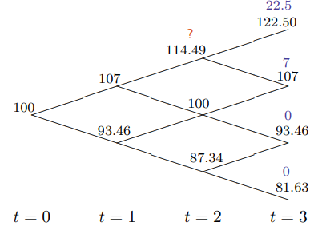

# Option Pricing in the Multi-Period Binomial Model

## The Multi-Period Binomial Model

Construct a multi-period Binomial model from a single-period Binomial model is simple, just treat the one output as next input.

* all the results from the 1-period model apply
* just need to multiply 1-period probabilities along branches to get

  probabilities in multi-period model.

 For example, suppose $$S_0 = 100, R = 1.01, u = \cfrac{1}{d} = 1.07$$ , then we could have

Remember that we have the following probability $$q$$ such that

$$Prob_u = q = \cfrac{R-d}{u-d} \\ Prob_d = 1-q = \cfrac{u-R}{u-d}$$ 

So the Binomial probability at t=3 is 

$$e^Q_r =\dbinom{n}{r} \cdot q^r \cdot (1-q)^{n-r}$$ 

### Pricing a European Call Option

Same as the above example, we have all call price at t = 3 which are $$22.5, 7, 0, 0$$ respectively, shown as follows.

In order to calculate the $$C_0$$ , we will work backward, calculate t=2, t=1 and then t=0. Remember that we have  

$$C_0 =  \cfrac{1}{R} E_0^{\color{red}{Q}} [C_1]$$ 

It is easy to obtain the following equation

$$C_0 =  \cfrac{1}{R^T} E_0^{\color{red}{Q}} [\vec{C_T}]$$ 

Where 

$$E^Q_0 = [e^Q_0, e^Q_1, ... e^Q_T] \\ \vec{C_T} = \max(\vec{S_T} - K,0)$$ 

* this is risk-neutral pricing in the binomial model
* avoids having to calculate the price at every node.

From above example, we have the following

Above models are risk-neutral, it feels wrong. But where is the problem?  It is because in a same economy, different p won't happen. 

Another surprising fact is that option price increases when R increase, which is different with deterministic world, where R increase implies cash flow decrease. 

### Existence of Risk-Neutral Probabilities  $$\Leftrightarrow$$ No-Arbitrage

Recall the Binomial model

* No arbitrage  $$\Leftrightarrow \, d<R<u$$ 
* Any derivative security with time $$T$$ payoff,  $$C_T$$, can be priced using

$$C_0 =  \cfrac{1}{R^n} E_0^{Q} [\vec{C_T}]$$ 

where $$0<q<1, n=\#$$ of periods. 

Because all the payoff at time T $$C_T \geq 0$$ so that the $$C_0 \geq 0$$. And if one of the $$C_T > 0$$ , then **Type A** and **Type B** arbitrage cannot happen. 

Reverse always true \(We proved that already\)

* If there is no arbitrager, then a risk-neutral distribution exists. 

Together, this statement **Existence of Risk-Neutral Probabilities**  $$\Leftrightarrow$$   **No-Arbitrage** are often called the _**First Fundamental Theorem of Asset Pricing**_

## Pricing American Options

### American Options' Features 

* American options can also be priced in same way as European options 
  * but now must also check if it’s optimal to **early** exercise at each node. 
* But recall **never optimal** to early exercise an American call option **on non-dividend paying stock**.
* As European Options, we should work backward to calculate the price, additionally, check the prices from on-ward Binomial with the current exercise price. 

For example, consider the American put price based on the above example

Put price is opposite to the call price

$$P_0 = \cfrac{1}{R} E_0^Q [\max(K-S_1, 0)]$$ 

And for the American Options,

$$P_0 =\max(K-S_0,  \cfrac{1}{R} E_0^Q [\max(K-S_1, 0)])$$ 

This is where 12.66 come from in above example.

### A Simple Die-Throw Game

Consider the following **game**: 

* You can throw a fair 6-sided die up to a maximum of **three** times. 
* After any throw, you can choose to ‘**stop**’ and obtain an amount of money **equal to the value you threw**.
  *  e.g. if 4 thrown on second throw and choose to ‘stop’, then obtain $4.

**Question**: If you are risk-neutral, how much would you pay to play this game?

**Solution**: Work backwards, starting with last possible throw: 

* You have just 1 throw left so fair value is 3.5
  * $$E_1 = \displaystyle\sum_{d=1}^{6} \cfrac{1}{6} \cdot d = 3.5$$ 
* You have 2 throws left so must figure out a strategy determining what to do for the 1st throw. We find 
  * $$E_2 = \cfrac{1}{2} \cdot 3.5 + \cfrac{1}{6} \cdot \displaystyle\sum_{d= 4}^6 d = 4.25$$ 

where $$d$$ starts from 4 because if we got the number greater than 4, we don't want to throw on the second time because at first time it already better than what we expected \( $$E_1 = 3.5$$ \). And we have $$\cfrac{3}{6} = \cfrac{1}{2}$$ possibility to throw again so the expected value for the second throw is $$\cfrac{1}{2} \cdot 3.5$$ 

* If we have three throws left, we know that the expectation of throwing 2 times is $$E_2 = 4.25$$ so that if the number is 5 or 6, we stop. Otherwise, we continue. Then we can get the following equation

$$E_3 = \cfrac{4}{6} \cdot E_2 + \cfrac{1}{6} \cdot \displaystyle\sum_{d=5}^{6} d = \cfrac{2}{3} \cdot 4.25 + \cfrac{1}{6}\cdot (5+6) = 4.67$$ 

Furthermore, we know that based on this strategy, if we play lots of time, eventually we will get 6 and stop. So the expectation of the infinity throws is 6. This is just like the American Option.  

## Replicating Strategies

### Terms

* Let $$S_t$$ denote the stock price at time $$t$$ 
* Let $$B_t$$ denote the value of the cash-account at time $$t$$ 
  * Assume w.l.o.g that $$B_0 = 1$$ so that $$B_t = R^t$$ 
  * So now explicitly\* viewing the cash account as a security\* 
* Let $$x_t$$ denote $$\#$$ of shares held between times $$t-1$$ and $$t=1,...,n.$$ 
* Let $$y_t$$ denote $$\#$$ of units of cash account held between times $$t-1$$ and $$t$$ for $$t=1,...,n.$$ 

### Trading Strategies in the Binomial Model

* The $$\theta_t := (x_t, y_t)$$ is the portfolio held:
  * immediately **after** trading at time $$t-1$$ so it is known at time $$t-1$$ 
  * and immediately **before** trading at time $$t$$
*  $$\theta_t$$ is also a random process and in particular, a **trading strategy**
* Also at same time, there may be multiple $$\theta_t$$ but they are different depends on the different values.
* The representation of the $$\theta_t$$ in Binomial model is shown as follows. 
  * However the $$\theta_0$$ is different.

### Self-Financing Trading Strategies

* **Definition**. The **value process**, $$V_t(\mathbf{\theta})$$ , associated with a trading strategy, $$\theta_t = (x_t, y_t)$$ , is defined by

$$V_t\begin{cases} x_1S_0 + y_1B_0  \; \;\text{for} \;\;t=0 \\ \\ x_tS_t + y_tB_t  \; \;\text{for} \;\;t>0 \end{cases}$$ 

* **Definition**. A **self-financing trading strategy** is a trading strategy, $$\theta_t = (x_t, y_t)$$ , where changes in $$V_t$$ are due entirely to trading gains or losses, rather than the addition or withdrawal of cash funds. In particular, a self-financing strategy satisfies 

$$V_t = x_{t+1} S_t + y_{t+1} B_t, \;\;\; t=1,...,n-1$$ 

* The definition states that the value of a self-financing portfolio just before trading is equal to the value of the portfolio just after trading. 
  * So no funds have been deposited or withdrawn
* Proposition\*. If a trading strategy, $$\theta_t$$ , is self-financing then the corresponding value process, $$V_t$$ , satisfies

$$V_{t+1} - V_t = x_{t+1}(S_{t+1} - S_t) + y_{t+1}(B_{t+1} - B_t)$$ 

* So that changes in portfolio value can only be due to capital gains or losses and not the injection or withdrawal of funds. 

### Risk-Neutral Price ≡ Price of Replicating Strategy

* We have seen how to price derivative securities in the binomial model. 
* The key to this was the use of the _1-period risk neutral probabilities_. 
* But we first priced options in 1-period models using a _replicating portfolio_
  * and we did this without needing to define risk-neutral probabilities
* In the multi-period model we can do the same, i.e., can construct a self-financing trading strategy that replicates the payoff of the option
  * this is called **dynamic replication**.
* The initial cost of this replicating strategy must equal the value of the option
  * otherwise there’s an arbitrage opportunity.
  * $$V_n  = C_n, V_0 = C_0$$ 
* The dynamic replication price is of course equal to the price obtained from using the risk-neutral probabilities and working backwards in the lattice.
* And at any node, the value of the option is equal to the value of the replicating portfolio at that node.

### The Replicating Strategy For Our European Option

* For each $$V_t$$ we calculate the option price and the replicating strategy. Recall 

 $$\begin{cases}uS_tx_t + B_ty_t = C_{t+1,u} \\ dS_tx_t + B_ty_t = C_{t+1,d} \end{cases}$$

* Self-financing condition tell us that 
  * Just before t : $$x_{t-1}S_t+y_{t-1}B_{t-1}R$$ 
  * Just after: $$x_tS_t + y_tB_tR$$ 
  * They should be the same. 
* For example
  * $$0.802\times 107-74.84\times 1.01 \approx 0.598 \times 107 - 53.25 \times 1.01$$ 

## Dividends

### Including Dividends

* Consider again 1-period model and assume stock pays a proportional dividend of $$cS_0$$ at t = 1.
* No-arbitrage conditions are now $$d + c < R < u + c.$$ 
* Can use same replicating portfolio argument to find price, $$C_0$$ , of any **derivative** security with payoff function, $$C_1(S_1)$$ , at time t = 1
* Set up replicating portfolio as before:

 $$\begin{cases}uS_0x + \mathbf{cS_0}x + Ry = C_u \\ dS_0x + \mathbf{cS_0}x + Ry = C_d \end{cases}$$

* Solve for x and y as before and then must have $$C_0 = xS_0 + y.$$ 

$$C_0 = \cfrac{1}{R} \bigg[ \cfrac{R-d-\mathbf{c}}{u-d}C_u +  \cfrac{u+\mathbf{c}-R}{u-d}C_d \bigg] \\ = \cfrac{1}{R}E_0^Q[C_1]$$ 

* Again, can price any derivative security in this 1-period model.
* Multi-period binomial model assumes a proportional dividend in each period
  * so dividend of $$cS_i$$ is paid at $$t = i + 1$$ for each i.
* Then each embedded 1-period model has identical risk-neutral probabilities
  * and derivative securities priced as before.
* In practice dividends are not paid in every period
  * and are therefore just a little more awkward to handle.

### The Binomial Model with Dividends

* Suppose the underlying security does **not** pay dividends. Then
  * This is just risk-neutral pricing of European call option with $$K=0$$ 

$$S_0 = E_0^Q\bigg[ \cfrac{S_n}{R^n}  \bigg]$$ 

* Suppose now underlying security **pays** dividends in each time period.
* Then we have 

$$S_0 = E_0^Q\bigg[ \cfrac{S_n}{R^n} + \displaystyle\sum_{i=1}^n \cfrac{D_i}{R^i} \bigg]$$ 

where $$D_i$$ is the dividend at time i , and $$S_n$$ is the **ex-dividend** security price at time n. It follows from risk-neutral pricing and observing that dividends and $$S_n$$ may be viewed as a portfolio of securities.

* View the $$i^{th}$$ dividend as a separate security with value

$$P_i = E^Q_0\bigg[ \cfrac{D_i}{R^i} \bigg]$$ 

* Then owner of underlying security owns a "portfolio" of securities at time 0 with value of 

$$\displaystyle\sum_{i=1}^n P_i + E_0^Q\bigg[ \cfrac{S_n}{R^n}\bigg]$$ 

* But value of underlying security is $$S_0$$ 
* Therefore 

$$S_0 = \displaystyle\sum_{i=1}^n P_i + E_0^Q\bigg[ \cfrac{S_n}{R^n}\bigg]$$ 

## Pricing Forward and Future in the Binomial Model

### Pricing Forward

* Have an n-period binomial model with $$u = \cfrac{1}{d}.$$
* Consider now a forward contract on the stock that expired after n period
* Let $$G_0$$ denote the "price" of the contract at time $$t = 0$$ 
* Recall $$G_0$$ is chosen so that contract is initially **worth zero**
* Therefore we have

$$0 = E_0^Q\bigg[ \cfrac{S_n - G_0}{R^n} \bigg]$$ 

so that 

$$\mathbf{G_0 = E_0^Q[S_n]}$$ 

*  this equation holds whether the underlying security pays dividends or not. 

### Pricing Future

* Consider now a futures contract on the stock that expires after n periods
* Let $$F_t$$ be the "price" of the future contract for $$t$$ where $$0\leq t \leq n.$$ 
  * Then $$F_n = S_n$$ 
* Need to note that a futures contract always **costs nothing**
* The “price”, $$F_t$$ is only used to determine the cash-flow associated with holding the contract
  * so that $$\pm (F_t - F_{t-1})$$ is the payoff received at time $$t$$ from a **long** or **short** position of one contract held between $$t − 1$$ and $$t$$ .
* In fact a futures contract can be characterized as a security that
  * is always worth **zero**
  * and that pays a dividend of $$(F_t − F_{t−1})$$ \(can be negative\)at each time $$t$$ .
* $$F_{n-1}$$  can be calculated by solving 

$$0 = E_{n-1}^Q \bigg[ \cfrac{F_n - F_{n-1}}{R} \bigg]$$ 

Why it is 0? Because the initial value of the future contract is 0 at time $$t=n-1$$ like we discussed above. Here $$n-1$$  from $$E_{n-1}^Q$$  means we use the information at  $$t=n-1$$  of risk-neutral expectation $$E^Q$$ . And we already know $$F_{n-1}$$ at time   $$t=n-1$$ , so that $$F_{n-1} E_{n-1}^Q = F_{n-1}$$ . So we have the following

$$F_{n-1} = E_{n-1}^Q[F_n]$$ 

* So that we have

$$F_t = E_t^Q[E_{t+1}^Q[...E_{n-1}^Q[F_n]...]$$ 

* Law of _iterated expectations_ then implies

$$F_t = E_t^Q[F_n]$$ 

* So the future price process is a **Q-martingale**
* Taking t = 0 and using $$F_n = S_n$$ we also have 

$$\mathbf{F_0 = E_0^Q[S_n]}$$ 

* Note this equation holds whether the security pays dividends or not.
  * dividends only enter through $$Q$$ 
* We also could have the following in Binomial model if $$R$$ **stay the same**

$$G_0 = F_0$$ 

## Black-Scholes Model

Black-Scholes assumed:

* A continuously-compounded interest rate of $$r$$ .
* **Geometric** **Brownian motion** dynamics for the stock price, $$S_t$$ , so that 

$$S_t = S_0 \cdot e^{(\mu - \sigma^2/2)\cdot t + \sigma W_t}$$ 

where $$W_t$$ is a **standard Brownian motion**

* The stock pays a **dividend yield** of $$c$$ 
* **Continuous trading** with no transactions costs and short-selling allows.

### The Black-Scholes Formula

* The **Black-Scholes formula** for the price of a European call option with strike $$K$$ and maturity $$T$$ is given by 

$$\mathbf{C_0 = S_0 \cdot e^{-cT}N(d_1) - Ke^{-rT}N(d_2)}$$ 

where

$$d_1 = \cfrac{log(S_0/K) + (r-c+\sigma^2/2)T}{\sigma \sqrt{T}}\\ d_2 = d_1 - \sigma \sqrt{T}$$ 

and $$N(d) = P(N(0,1)\leq d)$$ 

* Note that $$\mu$$ does not appear in the Black-Scholes formula
  * Just as $$p$$ is not used in option pricing calculations for the binomial model
* European put option price, $$P_0$$ , can be calculated from **put-call** parity

$$P_0 + S_0\cdot e^{-cT} = C_0 + K\cdot e^{-rT}$$ 

* Black-Scholes obtained their formula using a similar replicating strategy argument to the one we used for the binomial model
* In fact, can show that under the Black-Scholes GBM model

$$C_0 = E_0^Q[e^{-rT}\max(S_T - K, 0)]$$ 

where under $$Q$$ 

$$S_t = S_0\cdot e^{(r-c-\sigma^2/2)t + \sigma W_t}$$ 

### Calibrating a Binomial Model

* Often specific a binomial model in terms of Black-Scholes parameters:
  * $$r,$$ the continuously compounded interest rate
  * $$\sigma ,$$ the annualized **volatility**
* Can convert them into equivalent binomial model parameters
  * $$R_n = exp(r\cfrac{T}{n}), $$ where n = number of periods in binomial model
  * $$R_n - c_N = exp\big( (r-c)\cdot\cfrac{T}{n} \big) \approx 1 + r\cfrac{T}{n} - c\cfrac{T}{n}$$ 
  * $$u_n = exp\bigg( \sigma \sqrt{\cfrac{T}{n}} \bigg)$$ 
  * $$d_n = \cfrac{1}{u_n}$$ 
  * and now price European and American options, futures etc. as before
* Then risk-neutral probabilities calculated as 

$$q_n = \cfrac{e^{(r-c)\cfrac{T}{n}}-d_n}{u_n - d_n} = \cfrac{R_n - c_n - d_n}{u_n -d_n}$$ 

which like what we saw in binomial model.

### The Binomial Model as $$\Delta t \rightarrow 0$$ 

* Consider a binomial model with $$n$$ periods
  * Each period corresponds to time interval of $$\Delta t := \cfrac{T}{n}$$ 
* Recall that we can calculate European option price with strike $$K$$ as 

$$C_0 = \cfrac{1}{R^n}E_0^Q [\max(S_T-K),0]$$ 

* In the binomial model can write above equation as 

$$C_0 = \cfrac{1}{R_n^n}\displaystyle\sum_{j=0}^{n}\dbinom{n}{j}q^j_n(1-q_n)^{n-j} \max(S_0u_n^jd_n^{n-j } - K, 0) \\ = \cfrac{S_0}{R_n^n}\displaystyle\sum_{j=\eta}^n \dbinom{n}{j} q_n^j(1-q_n)^{n-j} u_n^j d_n^{n-j} - \cfrac{K}{R_n^n} \displaystyle\sum^n_{j=\eta} \dbinom{n}{j} q_n^j(1-q_n)^{n-j}$$ 

where $$\eta:=\min\{ j: S_0u_n^jd_n^{n-j} \geq K \}$$ , $$S_0u_n^jd_n^{n-j}$$ is the stock price of $$j$$ **up** moves and $$n-j$$ **down** moves. 

* It like the Black-Scholes equation shown above. And it is easy to show that if $$n \rightarrow \infty$$  then $$C_0$$ converges to the Black-Scholes formula

#### In practice

* We don't need a model to price liquid options
  * market forces, i.e. supply and demand, determines the price
  * which in this case amounts to determining $$\sigma$$ or the **implied volatility**
  * shown as follows

$$C_0 = E_0^Q[e^{-rT}\max(S_T - K, 0)]$$ 

where we can see that the $$C_0 $$ can be expressed as a function where

$$C_0 = \frak{F}(S_0, r, c, \mathbf{\sigma}, T, K)$$ 

where $$S_0, r, c, T, K \text{ and } C_0$$ are known to us.

* Models are required to hedge these options however
  * and price exotic or illiquid derivative securities

## Words


* explicitly
* security
* proposition


